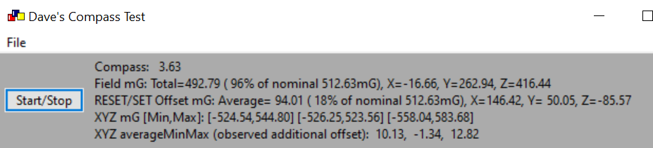
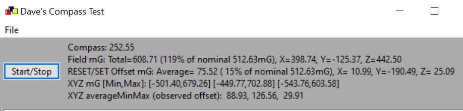

# MMC5983MA Compass Test - Quick-And-Dirty test
For reference see [Memsic MMC5983MA Compass Datasheet Rev A, Formal release date: 4/3/2019](https://www.memsic.com/Public/Uploads/uploadfile/files/20220119/MMC5983MADatasheetRevA.pdf)  
Also [Nine! videos about this part by Robert](https://www.youtube.com/@robertssmorgasbord/videos). 

The [MEMSIC MMC5983-B Prototyping Board](https://www.mouser.com/ProductDetail/MEMSIC/MMC5983-B?qs=B6kkDfuK7%2FDLJ5Gi%252B91PGg%3D%3D&mgh=1&gad_source=1) gets good results.
 
The [SparkFun Qwiic MMC5983MA board](https://www.sparkfun.com/products/19921)
yields poor results; field magnitude measurement problems highlight big offsets in each axis.
Likely caused by overheating during Sparkfun's soldering;
this part requires special low-temperature soldering.
 

To make a reading, I use the degauss procedure to find the mid-point
(the zero-field output value, inapproriately called 'offset' in MEMSIC datasheet).
Reminder: The film magnetization procedure uses a SET/RESET function which gives a big pulse and resets the device,
clearing any residual magnetization and setting the measurement polarity
(these functions might better be called MAGNETIZE_REVERSE_POLARITY and MAGNETIZE_FORWARD_POLARITY). 
Per the datasheet, I'm making a RESET, measuring, a SET, measuring.
Then calculate the center-value (nominal zero-field output which MEMSIC inappropriately calls _offset_) and measurement given two readings with opposite polarity.
All per the instructions in the datasheet.

Rotating the sensor at a spot in 3D, the measured field magnitude should be constant (no hard magnetic offsets on the test boards).
I rotate the sensor at a fixed point to find the minimum and maximum sensor output for each axis,
which should be identical magnitude if the degauss procedure works and the mid-point is found correctly.

My test program (this GitHub repository) is a C++ Windows program using wxWidgets,
communicating with the Qwiic MMC5983A boards using an Adafruit MCP2221 USB-to-Qwiic adapter.
Included is the MMC5983A C++ device driver I wrote (not yet complete).

# MEMSIC MMC5983-B Prototyping Board Good Results
I wired the MEMSIC evaluation board  to Qwiic and connected to my PC.
Rotating about a point I see reasonably constant field magnitude (95% to 105% of expected value),
and the min/max for all axis have consistent magnitude (though the Z axis has slightly higher gain):

# SparkFun Qwiic MMC5983MA 19921 Problems
 Update: The SparkFun MMC5983MA is not working properly!
The SparkFun compass fails a basic sanity test (constant field magnitude reading).
The problems detailed here are consistent with a damaged MMC5983MA,
caused by exceeding the allowed heating of the sensor during soldering.
Unfortunately I've had first-hand experience with this overheating problem
during production of our own boards.
 

Rotating the MMC5983MA at a fixed point in space, it's measuring different field magnitudes;
the magnitude should be constant.  Note magnitude is sqrt(X^2+Y^2+Z^2), and reported values range from 
131% down to 76% of the expected local field strength for my location (from WMM World Magnetic Model).
So in the right ballpark and making measurements, but definitely something is wrong.
[The file ExampleMagnitudeProblemLog.txt](ExampleMagnitudeProblemLog.txt) shows details of the erroneous readings.
The range of magnitudes measure imply really large gain differences between axis, the auto-zero SET/RESET process does not really auto-zero, and/or some other issue?

Further testing shows that there's a big offset in each axis. 
The RESET/SET degauss and sense-flip procedure is supposed to take out the offset (ie auto-zero each axis), except it's not working here. 
There's no hard offset in the test setup that would explain this behavior...
Here's an example after rotating the sensor to try find min and max for each axis:

# MMC5983MA datasheet problems:
The [Memsic MMC5983MA Compass Datasheet Rev A, Formal release date: 4/3/2019](https://www.memsic.com/Public/Uploads/uploadfile/files/20220119/MMC5983MADatasheetRevA.pdf) is seriously unclear on a number of points,
and sometimes conflicts with MEMSIC's sample code.
Unfortunately, I've had great difficulty getting sensible answers from MEMSIC technical support.

1) Continuous mode vs. one-shot mode aren't well documented.
   - a) Is it necessary to write TM_M to start measurements in continuous mode?
   - b) In continuous mode, is Meas_M_Done ever set?
   - c) Are TM_M and Meas_M_Done only for one-shot measurements?
   - d) Does temperature measurement require continuous pressure mode to be turned off? 
      **From MEMSIC: Temperature sensor does not really work, don't use it.**
2) Can SET and RESET used while continuous mode is enabled?
3) The use and behavior of auto-SET-RESET is not documented:
   - a) What is the PURPOSE of auto-SET-RESET? 
	  Unless a large field saturates the sensor, why is this helpful? 
	  How can this improve performance?
   - b) The Auto_SR_en bit is labeled "Automatic Set-Reset". 
	  What exactly does the sensor do if this bit is set? 
	  Does it operate in both continuous and one-shot mode?
   - c) The sample code provided by MEMSIC says "continuous mode with auto set and reset" - is that correct? 
	  The datasheet page 16 says "The device will perform a SET automatically...";
	  should that be "performs a periodic RESET/SET sequence"?
	  Which is the correct explanation of what the chip does? 
	  The order of SET and RESET determines the sensing polarity, so this needs to be clear, right? 
4) Explain saturation detection - what are the steps? 
   What is the additional applied saturation test field in Gauss when a saturation-enable bit is set? 
   Is it necessary to set the enable bits back to 0, or do they reset automatically like SET/RESET?
5) The datasheet says SET and RESET operations take 500 nsec. 
   MEMSIC sample code waits 500 usec. Which is correct?
6) The decimation filter is mentioned but not described. 
   Given BW and CM settings, What *exactly* is the sampling and filter?
7) OTP read controls are discussed, but OTP is never defined.
   What is it? Why do we care?  
   **From MEMSIC: OTP indicates MMC5983MA's one-time programming information was
   read successfully by firmware after the last reset. This bit should always be set.
   It should never be necessary to command the device to re-read OTP.**
